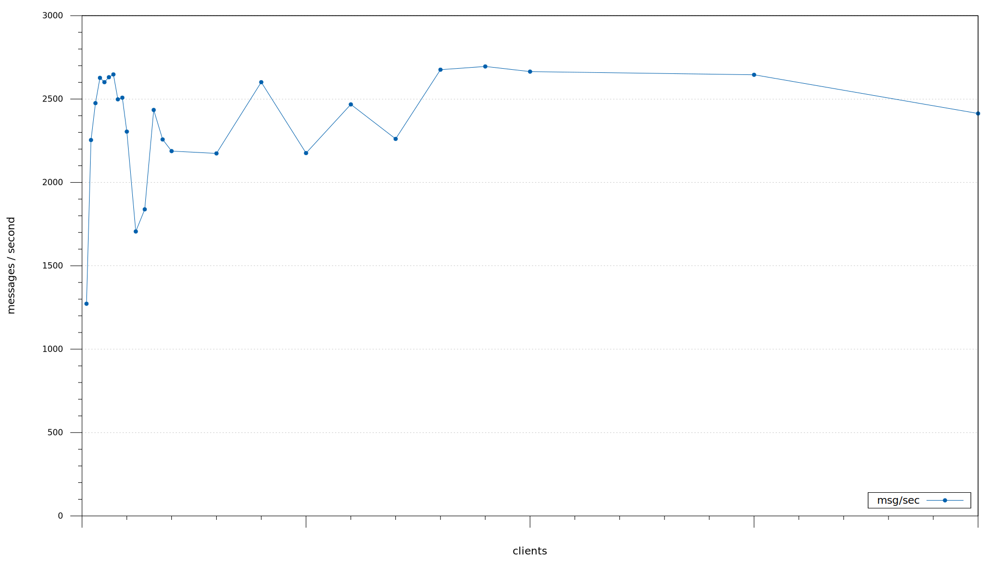
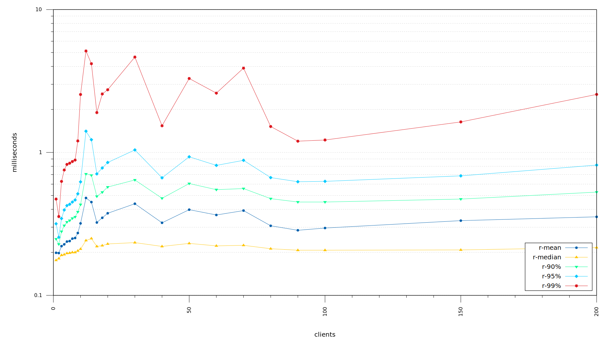
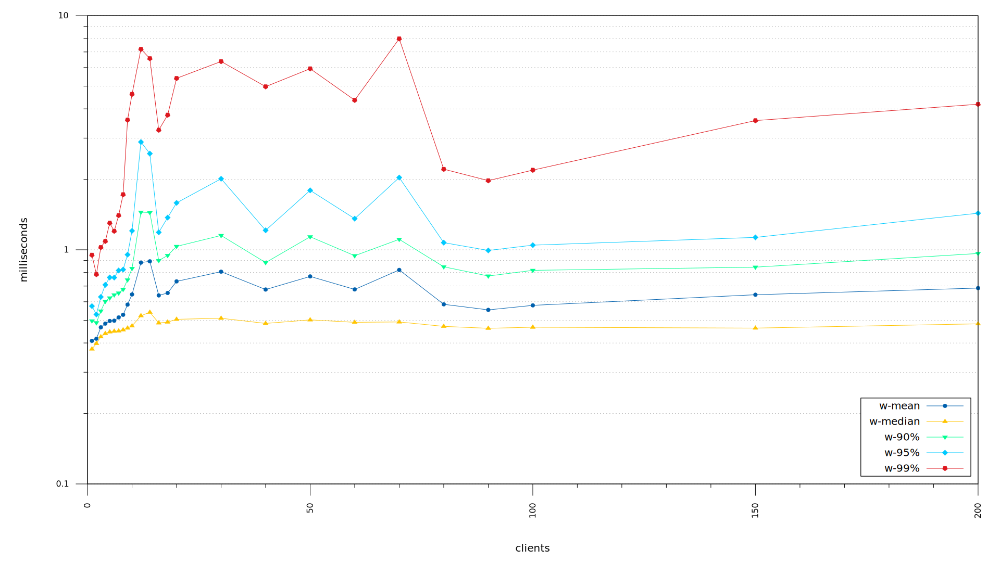

# linked-data-store-loadtest

Load-testing framework with GSIM inspired templates for LinkedDataStore

### Quickstart

Run a load-test by invoking one of the following scripts:
* `ldsmemory.sh`
* `ldsneo4j.sh`
* `ldspostgres.sh`

Output will be in one of the following folders after the loadtest has completed:
* `ldsmemory/results`
* `ldsneo4j/results`
* `ldspostgres/results`

### Prerequisites
* bash
* docker

### Example output

The following are examples of loadtest result output, they do not necessarily reflect current LDS performance but
is a demonstration of what sort of visual output you can expect.

##### Multiplot

##### Throughput

##### Read Latency (logscale)

##### Write Latency (logscale)

